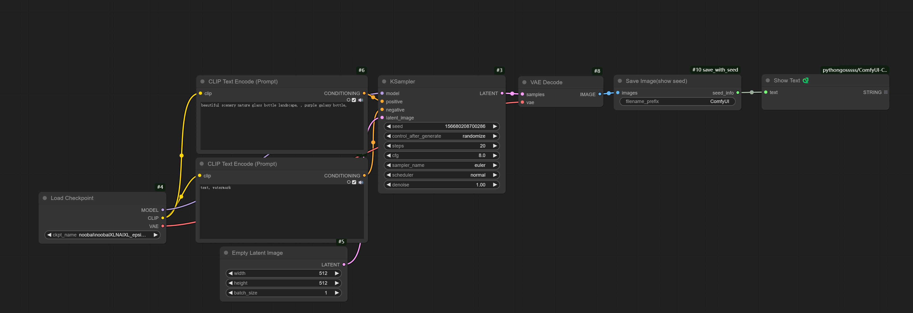

# ComfyUI Show Seed

A ComfyUI custom node that extracts and displays the seed value used in image generation.

## Features

- Extracts seed value from KSampler nodes
- Passes through image data unchanged
- Simple integration with existing ComfyUI workflows

## Installation

### Manual Installation
```bash
cd ComfyUI/custom_nodes/
git clone https://github.com/dreamhartley/ComfyUI_show_seed.git
```

## Usage

1. Find the node as "Show Seed"
2. Connect your image output to this node's image input
3. Connect the image output to a Save Image node
4. Connect the seed_info output to a Text node to display the seed value

## Example Workflow



The node works as a pass-through for image data while extracting the seed information:
- Input image → Show Seed → Save Image node
- Show Seed (seed_info) → Text node

## Node Outputs

- **images**: Original image data (connect to Save Image node)
- **seed_info**: Extracted seed value (connect to Text node)

## License

This project is licensed under the MIT License.