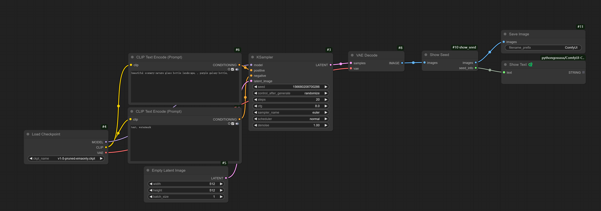

# ComfyUI Show Seed

A ComfyUI custom node that extracts and displays the seed value used in image generation, making it easier to track and reuse successful generations.

## Why This Node?

- ComfyUI randomly updates seed values after each generation
- Default interface doesn't show seed values intuitively
- Checking seed values of good results requires extra steps
- Difficult to upscale images while maintaining the same seed

## Features

- Extracts and displays seed values from KSampler nodes in real-time
- Passes through image data unchanged without affecting the workflow
- Simple and seamless integration with existing ComfyUI workflows
- Makes it easy to record and reproduce good results
- Improves workflow efficiency for image upscaling
- Zero configuration required - just plug and play

## Usage

1. Add the Show Seed node to your workflow
2. Connect it after your KSampler node
3. The seed value will be displayed directly on the node
4. Continue your workflow as normal - the image data passes through unchanged

## Installation

### Manual Installation
```bash
cd ComfyUI/custom_nodes/
git clone https://github.com/dreamhartley/ComfyUI_show_seed.git
```

## Example Workflow



The node works as a pass-through for image data while extracting the seed information:
- Input image → Show Seed → Save Image node
- Show Seed (seed_info) → Text node

## Node Outputs

- **images**: Original image data (connect to Save Image node)
- **seed_info**: Extracted seed value (connect to Text node)

## License

This project is licensed under the MIT License.
